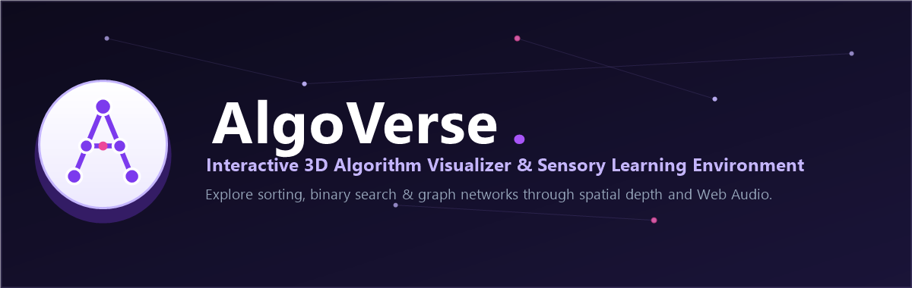
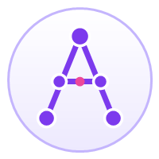

<p align="center">
  
</p>

<p align="center">
  <a href="#quickstart"><strong>Quickstart</strong></a> &middot;
  <a href="#supported-algorithms"><strong>Algorithms</strong></a> &middot;
  <a href="https://github.com/Sahajreddy07"><strong>GitHub</strong></a> &middot;
  <a href="https://www.linkedin.com/in/sahaj-reddy-83a43b371"><strong>LinkedIn</strong></a> &middot;
  <a href="https://x.com/sahaj1415"><strong>Twitter</strong></a> &middot;
  <a href="mailto:sahajporeddy@gmail.com"><strong>Email</strong></a>
</p>

<p align="center">
  <a href="LICENSE"></a>
  <a href="https://github.com/Sahajreddy07"></a>
  <a href="https://github.com/Sahajreddy07"></a>
  <a href="https://github.com/Sahajreddy07"></a>
</p>

<br/>

<div align="center">
  
</div>

<br/>

# AlgoVerse is the app people use to master algorithms in 3D.

Open-source interactive visualizer and harmonic acoustic simulator for computational intuition.

**If a chalkboard is a _lecture_, AlgoVerse is the _laboratory_.**

AlgoVerse transforms abstract data structures and sorting routines into tactile, interactive 3D geometry you can orbit, scrub, inspect, and listen to. Bring your own arrays, step through recursive merges or graph traversals, and hear every comparison and swap in real time from one unified canvas.

It looks like a high-end 3D portfolio. Under the hood: deterministic snapshot engines, Web Audio oscillators, lerp physics, raycasting tooltips, and synchronized line-by-line pseudocode telemetry.

**Master spatial intuition, not memorized steps.**

|        | Step            | Example                                                            |
| ------ | --------------- | ------------------------------------------------------------------ |
| **01** | Choose an algorithm | Bubble Sort, Merge Sort, Binary Search, BFS, or DFS.               |
| **02** | Interact in 3D  | Orbit 360°, inspect data structures, hear comparisons & swaps.     |
| **03** | Step and learn  | Scrub speed (0.2x–3.0x), step frame-by-frame, and watch code sync. |

<br/>

<div align="center">
<table>
  <tr>
    <td align="center"><strong>Visualizes<br/>with</strong></td>
    <td align="center"><br/><sub>Bubble Sort</sub></td>
    <td align="center"><br/><sub>Merge Sort</sub></td>
    <td align="center"><br/><sub>Binary Search</sub></td>
    <td align="center"><br/><sub>BFS</sub></td>
    <td align="center"><br/><sub>DFS</sub></td>
    <td align="center"><br/><sub>Custom Data</sub></td>
  </tr>
</table>

<em>If it has state transitions, it's visualized in 3D.</em>

</div>

<br/>

## AlgoVerse is right for you if

- ✅ You want to build **deep spatial intuition** for algorithmic operations
- ✅ You **coordinate complex pointer movements** (Low/Mid/High, FIFO Queues, LIFO Stacks)
- ✅ You have **20 browser tabs open** trying to visualize recursive divide-and-conquer steps
- ✅ You want algorithms running **frame-by-frame**, but still want to audit each comparison and swap
- ✅ You want to **hear operations in real time** through harmonic acoustic frequencies
- ✅ You want a process for studying algorithms that **feels like using an interactive 3D game**
- ✅ You want to test edge cases with **custom datasets from your browser**

<br/>

## The four pillars

Four things have to work for an algorithm visualizer to actually teach: the 3D physics, the sound, the telemetry, and the control plane. AlgoVerse is built around exactly those four pillars.

| Pillar | Built for | What it covers |
| --- | --- | --- |
| **3D WebGL Engine** — True spatial depth and tactile physics. | Everyone, daily | 360° OrbitControls · 2D/3D camera toggle · parabolic arched swaps · floating pointer cones · spherical node networks · raycasting inspect tooltips |
| **Programmatic Web Audio Synthesizer** — Acoustic feedback for state transitions. | Auditory intuition | 100% programmatic frequency generation · zero external audio files · user-gesture autoplay unlock · soft comparison beeps · punchy swap pops · crystalline node pings |
| **Real-Time Telemetry & Pseudocode** — Line-by-line sync with zero layout shift. | Students & interviewees | Active code line tracker · isolated internal scrolling (no page jumping) · natural language narration · live operation counters · floating FIFO Queue and LIFO Stack HUD |
| **Interactive Control Plane** — Precision scrubbing and customization. | Self-paced study | Step forward & step backward with deterministic state snapshots · 0.2x to 3.0x speed slider · custom dataset modal · interactive click-to-inspect · keyboard shortcuts |

<br/>

## Features

<table>
<tr>
<td align="center" width="33%">
<h3>🎮 360° 3D Orbit</h3>
Full WebGL orbit, scroll-to-zoom, and right-click pan. Switch between 3D perspective and 2D flat mode.
</td>
<td align="center" width="33%">
<h3>🔊 Harmonic Audio Synth</h3>
Programmatic Web Audio API feedback. Distinct acoustic signatures for comparisons, swaps, node visits, and resets.
</td>
<td align="center" width="33%">
<h3>🔲 Live Data Structure HUD</h3>
Floating in-canvas panel displaying real-time FIFO Queue (for BFS) and LIFO Stack (for DFS) mutations.
</td>
</tr>
<tr>
<td align="center">
<h3>⏱️ Frame-Accurate Scrubbing</h3>
Step forward or backward with 100% deterministic snapshot seeking. Never miss a single partition or exchange.
</td>
<td align="center">
<h3>🎯 Custom Datasets</h3>
Input custom comma-separated numbers (1–100) to test custom corner cases, reverse arrays, or duplicates.
</td>
<td align="center">
<h3>📊 Synchronized Pseudocode</h3>
Active algorithm code highlights dynamically. Container utilizes isolated internal scroll to eliminate page jumping.
</td>
</tr>
<tr>
<td align="center">
<h3>📱 Mobile & Touch Ready</h3>
Smooth touch rotation via <code>touch-action: none</code> and GPU compositing hints for seamless 60 FPS mobile performance.
</td>
<td align="center">
<h3>⚡ 100% Zero-Dependency Offline</h3>
Runs locally from single static files with offline-bundled Three.js r128. Zero npm packages, zero build steps.
</td>
<td align="center">
<h3>♿ Keyboard Accessible</h3>
Full keyboard hotkeys: <kbd>Space</kbd> for Play/Pause, <kbd>→</kbd>/<kbd>←</kbd> for stepping, <kbd>R</kbd> for Reset, and <kbd>M</kbd> for Mute.
</td>
</tr>
</table>

<br/>

## Problems AlgoVerse solves

| Without AlgoVerse                                                                                                             | With AlgoVerse                                                                                                                        |
| ----------------------------------------------------------------------------------------------------------------------------- | ------------------------------------------------------------------------------------------------------------------------------------- |
| ❌ Static chalkboard diagrams fail to show how pointers move, how recursion unwinds, or how arrays divide and merge.          | ✅ 3D spatial coordinates elevate subarrays in the Y-axis, animate parabolic arched swaps, and hover pointer cones over windows.       |
| ❌ Silent visualizers force your eyes to constantly dart between bars, pseudocode lines, and metric counters simultaneously.   | ✅ Harmonic audio frequencies let your ears identify comparisons, swaps, and node visits without taking your eyes off the data.       |
| ❌ Many web visualizers jerk or scroll the entire webpage whenever narration text changes or active code lines update.       | ✅ Fixed-height panels with internal-only smooth scrolling and fade transitions guarantee zero page jumping during execution.          |
| ❌ Web visualizers fail to play sound due to browser autoplay policies or missing external MP3 files.                         | ✅ 100% programmatic Web Audio API initializes strictly on user click gestures with an instant speaker toggle (`🔊`/`🔇`).           |
| ❌ You have to memorize algorithms without truly understanding how state transitions happen step by step.                    | ✅ Frame-by-frame backward and forward scrubbing lets you pause at any operation and inspect exact variable values.                   |
| ❌ Heavy modern web apps require complex Node.js build tools, webpack configs, and external CDNs that break offline.         | ✅ Zero build pipeline: pure semantic HTML, vanilla CSS, and standard ES6 JavaScript with bundled local Three.js vendor files.       |

<br/>

## Why AlgoVerse is special

AlgoVerse handles the subtle nuances of algorithmic animation correctly.

|                                        |                                                                                                                                           |
| -------------------------------------- | ----------------------------------------------------------------------------------------------------------------------------------------- |
| **Deterministic snapshot seeking.**    | Every step captures an exact state snapshot. You can step backward in time with frame-accurate element values, heights, and states.    |
| **Zero-latency Web Audio.**            | No audio files to fetch or decode. Oscillators are synthesized on the fly via mathematical waveforms for instantaneous, punchy feedback. |
| **Parabolic 3D arched swaps.**         | Rather than sliding linearly through each other, swapped bars elevate along a 3D arch so the transition is crystal-clear in space.      |
| **Isolated container scrolling.**      | Pseudocode tracking scrolls strictly inside its dedicated block using `scrollTop` math, completely eliminating page viewport jumping.   |
| **Instant mute with cutoff.**          | Toggle mute (`🔊`/`🔇`) immediately stops all active oscillators mid-animation and persists your preference for the session.             |
| **Offline-first architecture.**        | All dependencies (Three.js, OrbitControls) are stored locally in `vendor/`. Double-click `index.html` to run anywhere without internet.  |

<br/>

## What's Under the Hood

AlgoVerse is a full 3D interactive runtime, not a passive video. Before you build any of this yourself, know that it already exists:

```
┌──────────────────────────────────────────────────────────────┐
│                      ALGOVERSE RUNTIME                       │
│                                                              │
│  ┌───────────┐  ┌───────────┐  ┌───────────┐  ┌───────────┐  │
│  │  AlgoApp  │  │ Step-by-  │  │ Three.js  │  │Web Audio  │  │
│  │Controller │  │Step Engine│  │3D Visuals │  │Synthesizer│  │
│  └───────────┘  └───────────┘  └───────────┘  └───────────┘  │
│                                                              │
│  ┌───────────┐  ┌───────────┐  ┌───────────┐  ┌───────────┐  │
│  │ Bubble &  │  │  Binary   │  │BFS & DFS  │  │ Live Data │  │
│  │Merge Sort │  │  Search   │  │   Graph   │  │ Structure │  │
│  │  Engines  │  │  Engine   │  │  Engines  │  │    HUD    │  │
│  └───────────┘  └───────────┘  └───────────┘  └───────────┘  │
│                                                              │
│  ┌───────────┐  ┌───────────┐  ┌───────────┐  ┌───────────┐  │
│  │ Timeline  │  │  Camera   │  │Pseudocode │  │ Particle  │  │
│  │ & Speed   │  │   Orbit   │  │ & Metrics │  │Celebration│  │
│  │ Controls  │  │ Controller│  │ Telemetry │  │  Physics  │  │
│  └───────────┘  └───────────┘  └───────────┘  └───────────┘  │
└──────────────────────────────────────────────────────────────┘
         ▲              ▲              ▲              ▲
   ┌─────┴─────┐  ┌─────┴─────┐  ┌─────┴─────┐  ┌─────┴─────┐
   │ Sorting   │  │ Searching │  │   Graph   │  │  Custom   │
   │  Routines │  │ Intervals │  │ Traversals│  │  Datasets │
   └───────────┘  └───────────┘  └───────────┘  └───────────┘
```

### The Systems

<table>
<tr>
<td width="50%">

**Three.js 3D Visualizer (`visualizer.js`)** — Manages perspective camera, ambient/directional lights, purple & pink accent point lights, ground plane shadow receiving, OrbitControls, 2D/3D toggle, and raycasting mouse interactions.

</td>
<td width="50%">

**Web Audio Synthesizer (`sound.js`)** — Programmatically generates tones on a single shared AudioContext initialized upon user gesture. Manages frequencies, envelopes, master gain, active oscillator tracking, and session mute persistence.

</td>
</tr>
<tr>
<td>

**Application State Machine (`app.js`)** — Controls playback lifecycle (play, pause, step forward, step backward, reset), timeline speeds (0.2x–3.0x), data generation, live HUD DOM updates, and keyboard shortcut event listeners.

</td>
<td>

**Modular Algorithm Engines (`js/algorithms/*.js`)** — Self-contained step generators. Each algorithm operates in isolation, computing state snapshots, comparisons, swaps, pseudocode line mapping, and natural language narration text.

</td>
</tr>
<tr>
<td>

**Live HUD & Data Structures** — Floating real-time displays for BFS FIFO Queues and DFS LIFO Stacks. Watch elements enqueue and dequeue synchronously with 3D node activations.

</td>
<td>

**Particle Physics System** — Procedural 36-particle burst emitter that calculates velocities, gravity, and opacity decay for celebration states on completion or target discovery.

</td>
</tr>
</table>

<br/>

## What AlgoVerse is not

|                              |                                                                                                                      |
| ---------------------------- | -------------------------------------------------------------------------------------------------------------------- |
| **Not a black-box video.**   | You are in full control of the camera angle, playback speed, timeline scrubbing, and array data values.             |
| **Not an audio file player.**| No MP3s, WAVs, or external media files. Tones are synthesized in real-time code for instant playback and sync.       |
| **Not a heavy npm project.** | No build dependencies, node_modules, webpack, or bundlers. Works immediately in any web browser.                    |
| **Not a flat 2D chart.**     | Everything exists in three dimensions with depth, shadows, rotation, and elevation.                                  |
| **Not a single-algo demo.**  | Features sorting (Bubble, Merge), searching (Binary Search), and graph traversals (BFS, DFS) under one unified UI.   |

<br/>

## Quickstart

Open source. Self-hosted. Zero dependencies.

```bash
git clone https://github.com/Sahajreddy07/AlgoVerse.git
cd AlgoVerse
```

Open `index.html` in your browser:

- **Windows:** Double-click `index.html` or run `start index.html`
- **macOS:** `open index.html`
- **Linux:** `xdg-open index.html`

Or run a local lightweight server:

```bash
# Using Python 3
python -m http.server 8000

# Using Node.js
npx serve .
```

Then visit `http://localhost:8000` in your browser.

> **Requirements:** Any modern web browser (Chrome, Firefox, Safari, Edge). No Node.js or npm required.

<br/>

## FAQ

**What does a typical setup look like?**
Locally, pure static files: HTML, CSS, and vanilla JS. Three.js and OrbitControls are stored locally inside `vendor/`. Double-click `index.html` and you're ready.

**How does the sound work without external audio files?**
AlgoVerse uses the browser's native Web Audio API. When a comparison or swap occurs, an oscillator node generates a brief tone with an exponential gain decay curve. Zero assets are downloaded.

**Why was sound silent initially on some browsers?**
Browsers require a user gesture (like clicking Play or Mute) before allowing an `AudioContext` to run. AlgoVerse initializes the audio context strictly inside click handlers, complying with all autoplay restrictions.

**Can I enter my own custom numbers?**
Yes. Click the **Custom Data** button in the canvas header bar, enter comma-separated numbers (1–100), and hit Apply.

**How do I rotate and inspect the 3D canvas?**
Left-click and drag to orbit 360°. Scroll wheel zooms in/out. Right-click and drag pans. Hover over any bar or node to inspect its index and value via the 3D raycast tooltip.

<br/>

## Supported Algorithms

| Algorithm | Category | Best Time | Average Time | Worst Time | Space | 3D Visual Mode |
| :--- | :--- | :---: | :---: | :---: | :---: | :--- |
| **Bubble Sort** | Sorting | $\mathcal{O}(n)$ | $\mathcal{O}(n^2)$ | $\mathcal{O}(n^2)$ | $\mathcal{O}(1)$ | Extruded 3D bars · purple comparison glow · arched pink swap lift |
| **Merge Sort** | Sorting | $\mathcal{O}(n \log n)$ | $\mathcal{O}(n \log n)$ | $\mathcal{O}(n \log n)$ | $\mathcal{O}(n)$ | Subarray vertical elevation · auxiliary merge placement & scale |
| **Binary Search** | Searching | $\mathcal{O}(1)$ | $\mathcal{O}(\log n)$ | $\mathcal{O}(\log n)$ | $\mathcal{O}(1)$ | 3D numbered cubes · floating LOW/MID/HIGH cone markers · particle burst |
| **BFS** | Graph | $\mathcal{O}(V + E)$ | $\mathcal{O}(V + E)$ | $\mathcal{O}(V + E)$ | $\mathcal{O}(V)$ | Spherical network · glowing tube edges · live FIFO Queue HUD |
| **DFS** | Graph | $\mathcal{O}(V + E)$ | $\mathcal{O}(V + E)$ | $\mathcal{O}(V + E)$ | $\mathcal{O}(V)$ | Deep branch traversal · backtrack return animation · live LIFO Stack HUD |

<br/>

## Keyboard Shortcuts

| Key | Action |
| --- | --- |
| <kbd>Space</kbd> | Toggle Play / Pause |
| <kbd>→</kbd> | Step forward one frame |
| <kbd>←</kbd> | Step backward one frame |
| <kbd>R</kbd> | Reset playback to initial state |
| <kbd>M</kbd> | Mute / Unmute audio sound effects (`🔊` / `🔇`) |

<br/>

## Roadmap

- ✅ 3D sorting visualizations (Bubble Sort, Merge Sort)
- ✅ 3D searching visualizations (Binary Search with floating cone pointers)
- ✅ 3D graph traversals (BFS layer-by-layer, DFS branch & backtrack)
- ✅ Web Audio programmatic frequency synthesis
- ✅ Live Queue & Stack HUD panels
- ✅ Raycasting hover & click inspection tooltips
- ✅ Isolated internal container scrolling (zero page jumping)
- ✅ 2D / 3D camera projection toggle
- ✅ Custom dataset modal
- ✅ Keyboard shortcuts
- ⚪ Quick Sort 3D visualization (Pivot elevation)
- ⚪ Dijkstra's Algorithm 3D (Weighted path glow)
- ⚪ A* Pathfinding in 3D voxel grid
- ⚪ Custom graph builder (click to add nodes & edges)
- ⚪ Export animation as GIF / WebM

<br/>

## Author & Community

- **Creator:** P. Sahaj Reddy
- **GitHub:** [@Sahajreddy07](https://github.com/Sahajreddy07)
- **LinkedIn:** [Sahaj Reddy](https://www.linkedin.com/in/sahaj-reddy-83a43b371)
- **Twitter / X:** [@sahaj1415](https://x.com/sahaj1415)
- **Email:** [sahajporeddy@gmail.com](mailto:sahajporeddy@gmail.com)

<br/>

## License

MIT &copy; 2026 [P. Sahaj Reddy](https://github.com/Sahajreddy07)

---

<p align="center">
  <sub>Open source under MIT. Built for developers, students, and educators who want to see computation think.</sub>
</p>
