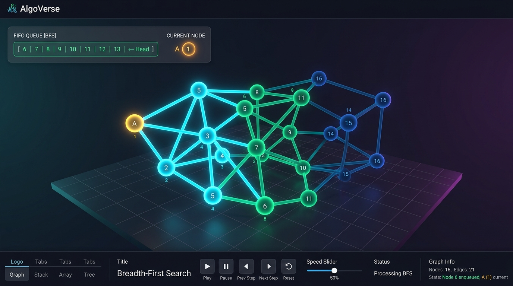
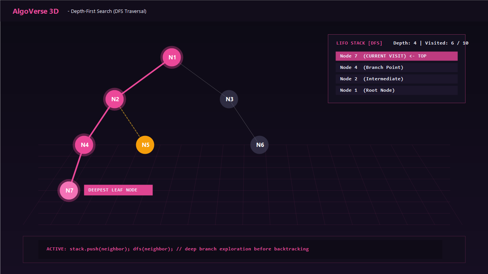
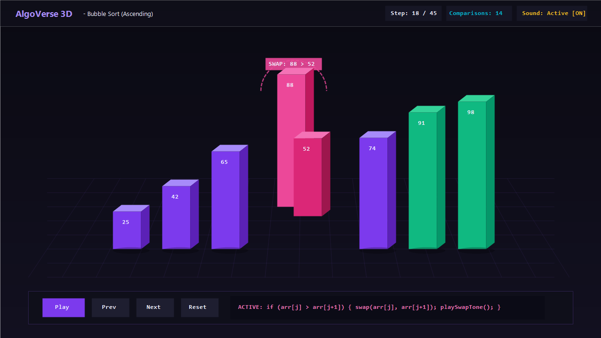
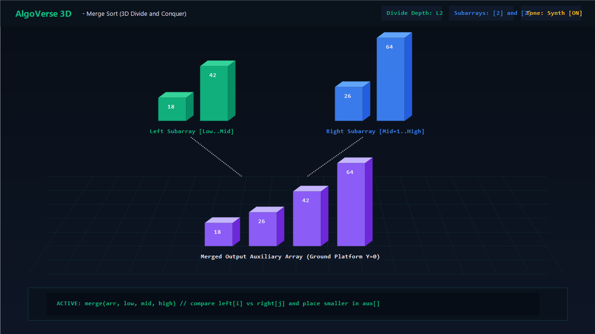
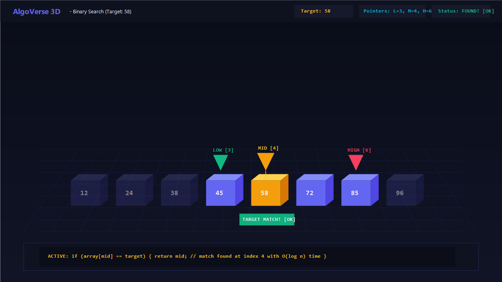

<p align="center">
  
</p>

<p align="center">
  <a href="#quickstart"><strong>Quickstart</strong></a> &middot;
  <a href="#-interactive-3d-visualizations"><strong>Visualizations</strong></a> &middot;
  <a href="#supported-algorithms-reference"><strong>Algorithms</strong></a> &middot;
  <a href="#-the-four-pillars"><strong>The Four Pillars</strong></a> &middot;
  <a href="#features"><strong>Features</strong></a> &middot;
  <a href="#keyboard-shortcuts"><strong>Shortcuts</strong></a> &middot;
  <a href="https://github.com/Sahajreddy07"><strong>GitHub</strong></a> &middot;
  <a href="https://www.linkedin.com/in/sahaj-reddy-83a43b371"><strong>LinkedIn</strong></a> &middot;
  <a href="https://x.com/sahaj1415"><strong>Twitter</strong></a> &middot;
  <a href="mailto:sahajporeddy@gmail.com"><strong>Email</strong></a>
</p>

<p align="center">
  <a href="LICENSE"></a>
  <a href="https://github.com/Sahajreddy07"></a>
  <a href="https://github.com/Sahajreddy07"></a>
  <a href="https://github.com/Sahajreddy07"></a>
</p>

<br/>

<div align="center">
  
</div>

<br/>

# AlgoVerse is the app people use to master algorithms in 3D.

Open-source interactive visualizer and acoustic simulator for computational intuition.

**If a chalkboard is a _lecture_, AlgoVerse is the _laboratory_.**

AlgoVerse transforms abstract data structures and sorting routines into tactile, interactive 3D geometry you can orbit, scrub, inspect, and listen to. Bring your own arrays, step through recursive merges or graph traversals, and hear every comparison and swap in real time from one unified canvas.

It looks like a high-end 3D portfolio. Under the hood: deterministic snapshot engines, Web Audio oscillators, lerp physics, raycasting tooltips, and synchronized line-by-line pseudocode telemetry.

**Master spatial intuition, not memorized steps.**

|        | Step            | Example                                                            |
| ------ | --------------- | ------------------------------------------------------------------ |
| **01** | Choose an algorithm | Bubble Sort, Merge Sort, Binary Search, BFS, or DFS.               |
| **02** | Interact in 3D  | Orbit 360°, inspect data structures, hear comparisons & swaps.     |
| **03** | Step and learn  | Scrub speed (0.2x–3.0x), step frame-by-frame, and watch code sync. |

<br/>

<div align="center">
<table>
  <tr>
    <td align="center"><strong>Visualizes<br/>in 3D</strong></td>
    <td align="center"><a href="#-breadth-first-search-bfs"><br/><sub><strong>BFS</strong></sub></a></td>
    <td align="center"><a href="#-depth-first-search-dfs"><br/><sub><strong>DFS</strong></sub></a></td>
    <td align="center"><a href="#-bubble-sort"><br/><sub><strong>Bubble Sort</strong></sub></a></td>
    <td align="center"><a href="#-merge-sort"><br/><sub><strong>Merge Sort</strong></sub></a></td>
    <td align="center"><a href="#-binary-search"><br/><sub><strong>Binary Search</strong></sub></a></td>
    <td align="center"><a href="#-custom-datasets"><br/><sub><strong>Custom Data</strong></sub></a></td>
  </tr>
</table>

<em>If it has state transitions, it's visualized in 3D.</em>

</div>

<br/>

## 📸 Interactive 3D Visualizations

Here is how each algorithm renders inside the live 3D WebGL engine with spatial depth, particle physics, and real-time Web Audio synthesis:

---

### 🌐 Breadth-First Search (BFS)
> **Layer-by-layer radial graph expansion with a real-time FIFO Queue HUD.**

<p align="center">
  
</p>

* **3D Mechanics:** Nodes are rendered as illuminated spheres on a dark perspective grid. Expanding wavefronts glow in cyber-cyan, lighting up connected edges as neighbor nodes are discovered layer by layer.
* **Live FIFO Queue HUD:** A floating in-canvas display updates synchronously on every step, showing elements enqueuing at the tail and dequeuing at the head (`[ 6 | 7 | 8 | 9 ... ← Head ]`).
* **Sound Feedback:** Subtle high-register ping tones on node enqueue; distinct harmonic chimes upon target discovery.

---

### 🔮 Depth-First Search (DFS)
> **Deep branch exploration with backtracking trails and a live LIFO Stack HUD.**

<p align="center">
  
</p>

* **3D Mechanics:** Traverses as deep as possible along each branch before backtracking. The active traversal path illuminates in vivid neon magenta, while backtracked segments leave an amber dashed trail.
* **Live LIFO Stack HUD:** The floating stack panel renders push and pop operations in real time, with the top pointer tracking the current recursive call frame (`Node 7 ← TOP`).
* **Sound Feedback:** Descending frequency tones as recursion deepens; ascending resolution tones upon backtracking.

---

### 🟣 Bubble Sort
> **3D extruded comparison bars with parabolic arched swaps.**

<p align="center">
  
</p>

* **3D Mechanics:** Array elements are modeled as 3D beveled bars with heights proportional to their values. When two adjacent elements are out of order, they elevate along a smooth **3D parabolic arch** rather than sliding flat through one another.
* **Visual Telemetry:** Violet comparison glow beneath the active pair, instantaneous swap badge display (`SWAP: 88 > 52`), and emerald coloring for sorted elements.
* **Sound Feedback:** Soft short beeps (sine wave, 220Hz–440Hz) on comparison; punchy pop chime (triangle wave, 520Hz) on swap.

---

### 🟢 Merge Sort
> **Divide-and-conquer elevation with 3D recursive subarray partitions.**

<p align="center">
  
</p>

* **3D Mechanics:** Recursive splits elevate subarrays along the Y-axis into distinct floating spatial tiers. The left subarray glows in emerald and the right in electric blue, before merging down into sorted positions on the ground plane.
* **Visual Telemetry:** Color-coded division depth markers (`L1`, `L2`), dotted merge projection lines, and live comparison indicators between `left[i]` and `right[j]`.
* **Sound Feedback:** Dual-tone chord synthesis highlighting which partition element is lower and placed into the auxiliary buffer.

---

### 🔵 Binary Search
> **3D numbered cubes with floating LOW, MID, and HIGH pointer cones.**

<p align="center">
  
</p>

* **3D Mechanics:** The sorted array is visualized as tactile numbered 3D blocks. Inverted glowing cones hover directly above the active pointers: 🟢 **LOW**, 🟡 **MID**, and 🔴 **HIGH**, casting downward laser focus beams.
* **Elimination Shading:** Half of the search space is dynamically dimmed out with semi-transparent shading on every comparison.
* **Celebration Physics:** When `array[mid] == target`, a 36-particle gold and emerald burst explodes outward with celebratory audio fanfare.

---

<br/>

## AlgoVerse is right for you if

- ✅ You want to build **deep spatial intuition** for algorithmic operations
- ✅ You **coordinate complex pointer movements** (Low/Mid/High, FIFO Queues, LIFO Stacks)
- ✅ You have **20 browser tabs open** trying to visualize recursive divide-and-conquer steps
- ✅ You want algorithms running **frame-by-frame**, but still want to audit each comparison and swap
- ✅ You want to **hear operations in real time** through harmonic acoustic frequencies
- ✅ You want a process for studying algorithms that **feels like using an interactive 3D game**
- ✅ You want to test edge cases with **custom datasets from your browser**

<br/>

## The four pillars

Four things have to work for an algorithm visualizer to actually teach: the 3D physics, the sound, the telemetry, and the control plane. AlgoVerse is built around exactly those four pillars.

| Pillar | Built for | What it covers |
| --- | --- | --- |
| **3D WebGL Engine** — True spatial depth and tactile physics. | Everyone, daily | 360° OrbitControls · 2D/3D camera toggle · parabolic arched swaps · floating pointer cones · spherical node networks · raycasting inspect tooltips |
| **Programmatic Web Audio Synthesizer** — Acoustic feedback for state transitions. | Auditory intuition | 100% programmatic frequency generation · zero external audio files · user-gesture autoplay unlock · soft comparison beeps · punchy swap pops · crystalline node pings |
| **Real-Time Telemetry & Pseudocode** — Line-by-line sync with zero layout shift. | Students & interviewees | Active code line tracker · isolated internal scrolling (no page jumping) · natural language narration · live operation counters · floating FIFO Queue and LIFO Stack HUD |
| **Interactive Control Plane** — Precision scrubbing and customization. | Self-paced study | Step forward & step backward with deterministic state snapshots · 0.2x to 3.0x speed slider · custom dataset modal · interactive click-to-inspect · keyboard shortcuts |

<br/>

## Features

<table>
<tr>
<td align="center" width="33%">
<h3>🎮 360° 3D Orbit</h3>
Full WebGL orbit, scroll-to-zoom, and right-click pan. Switch between 3D perspective and 2D flat mode.
</td>
<td align="center" width="33%">
<h3>🔊 Harmonic Audio Synth</h3>
Programmatic Web Audio API feedback. Distinct acoustic signatures for comparisons, swaps, node visits, and resets.
</td>
<td align="center" width="33%">
<h3>🔲 Live Data Structure HUD</h3>
Floating in-canvas panel displaying real-time FIFO Queue (for BFS) and LIFO Stack (for DFS) mutations.
</td>
</tr>
<tr>
<td align="center">
<h3>⏱️ Frame-Accurate Scrubbing</h3>
Step forward or backward with 100% deterministic snapshot seeking. Never miss a single partition or exchange.
</td>
<td align="center">
<h3>🎯 Custom Datasets</h3>
Input custom comma-separated numbers (1–100) to test custom corner cases, reverse arrays, or duplicates.
</td>
<td align="center">
<h3>📊 Synchronized Pseudocode</h3>
Active algorithm code highlights dynamically. Container utilizes isolated internal scroll to eliminate page jumping.
</td>
</tr>
<tr>
<td align="center">
<h3>📱 Mobile & Touch Ready</h3>
Smooth touch rotation via <code>touch-action: none</code> and GPU compositing hints for seamless 60 FPS mobile performance.
</td>
<td align="center">
<h3>⚡ 100% Zero-Dependency Offline</h3>
Runs locally from single static files with offline-bundled Three.js r128. Zero npm packages, zero build steps.
</td>
<td align="center">
<h3>♿ Keyboard Accessible</h3>
Full keyboard hotkeys: <kbd>Space</kbd> for Play/Pause, <kbd>→</kbd>/<kbd>←</kbd> for stepping, <kbd>R</kbd> for Reset, and <kbd>M</kbd> for Mute.
</td>
</tr>
</table>

<br/>

## Problems AlgoVerse solves

| Without AlgoVerse                                                                                                             | With AlgoVerse                                                                                                                        |
| ----------------------------------------------------------------------------------------------------------------------------- | ------------------------------------------------------------------------------------------------------------------------------------- |
| ❌ Static chalkboard diagrams fail to show how pointers move, how recursion unwinds, or how arrays divide and merge.          | ✅ 3D spatial coordinates elevate subarrays in the Y-axis, animate parabolic arched swaps, and hover pointer cones over windows.       |
| ❌ Silent visualizers force your eyes to constantly dart between bars, pseudocode lines, and metric counters simultaneously.   | ✅ Harmonic audio frequencies let your ears identify comparisons, swaps, and node visits without taking your eyes off the data.       |
| ❌ Many web visualizers jerk or scroll the entire webpage whenever narration text changes or active code lines update.       | ✅ Fixed-height panels with internal-only smooth scrolling and fade transitions guarantee zero page jumping during execution.          |
| ❌ Web visualizers fail to play sound due to browser autoplay policies or missing external MP3 files.                         | ✅ 100% programmatic Web Audio API initializes strictly on user click gestures with an instant speaker toggle (`🔊`/`🔇`).           |
| ❌ You have to memorize algorithms without truly understanding how state transitions happen step by step.                    | ✅ Frame-by-frame backward and forward scrubbing lets you pause at any operation and inspect exact variable values.                   |
| ❌ Heavy modern web apps require complex Node.js build tools, webpack configs, and external CDNs that break offline.         | ✅ Zero build pipeline: pure semantic HTML, vanilla CSS, and standard ES6 JavaScript with bundled local Three.js vendor files.       |

<br/>

## Why AlgoVerse is special

AlgoVerse handles the subtle nuances of algorithmic animation correctly.

|                                        |                                                                                                                                           |
| -------------------------------------- | ----------------------------------------------------------------------------------------------------------------------------------------- |
| **Deterministic snapshot seeking.**    | Every step captures an exact state snapshot. You can step backward in time with frame-accurate element values, heights, and states.    |
| **Zero-latency Web Audio.**            | No audio files to fetch or decode. Oscillators are synthesized on the fly via mathematical waveforms for instantaneous, punchy feedback. |
| **Parabolic 3D arched swaps.**         | Rather than sliding linearly through each other, swapped bars elevate along a 3D arch so the transition is crystal-clear in space.      |
| **Isolated container scrolling.**      | Pseudocode tracking scrolls strictly inside its dedicated block using `scrollTop` math, completely eliminating page viewport jumping.   |
| **Instant mute with cutoff.**          | Toggle mute (`🔊`/`🔇`) immediately stops all active oscillators mid-animation and persists your preference for the session.             |
| **Offline-first architecture.**        | All dependencies (Three.js, OrbitControls) are stored locally in `vendor/`. Double-click `index.html` to run anywhere without internet.  |

<br/>

## Quickstart

Open source. Self-hosted. Zero dependencies.

```bash
git clone https://github.com/Sahajreddy07/AlgoVerse.git
cd AlgoVerse
